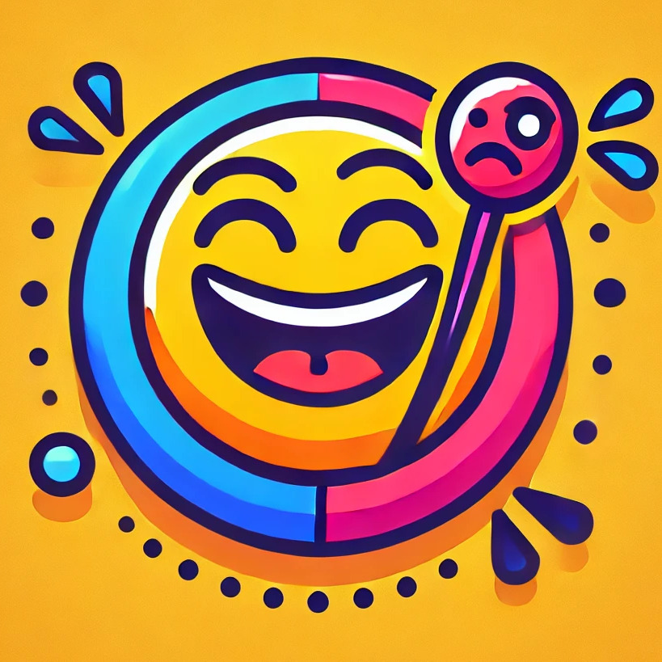
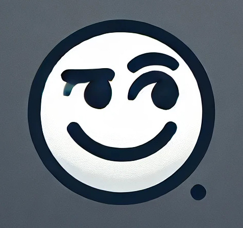

<h1 align="center">
  
  
  Code-Mixed Humor & Sarcasm Detection
</h1>

<p align="center">
  <!-- PyTorch Badge -->
  <a href="https://pytorch.org">
    
  </a>
  
  <!-- Hugging Face Badge -->
  <a href="https://huggingface.co">
    
  </a>
</p>

---

This repository contains the code for the paper: <b>"Improving code-mixed humor and sarcasm detection through multi-tasking
and native sample mixing"</b>. We strongly recommend that you run our codes on the same settings to ensure reproducibility. 

### Requirements

Python 3.6 or higher <br>
Pytorch >= 1.3.0 <br>
transformers  <br>
Pandas, Numpy <br>

### Setup:
1. Clone the repository:
   ```bash
   git clone https://github.com/your-username/code-mixed-humor-sarcasm-detection.git
   ```
2. Install dependencies:
   ```bash
   pip install -r requirements.txt
   ```
3. Download and prepare the datasets. (Instructions can be found in the data/README.md file)
4. Train and evaluate models using the provided scripts in this directory.

### Dataset

We have used publicly  available datasets. For humor(Hindi) and sarcasm(Hindi), we have translated corresponding English dataset using Google Translate. To run the code for humor and sarcasm, one can change the data path accordingly.

### Arguments:

For Multi-Task model results:

```
--epochs:  number of total epochs to run, default=50

--batch-size: train batchsize, default=32

--lr: learning rate for the model, default=2e-5

--seq_len: sequence lenght of input text, default=128
```

### Training
 For results on native samples mixing:

```bash
python3 Native_samples_results/{model}.py
```


For Multi-Task model results:

```
python3 Multi-tasking_results/mtl_two_tasks.py

python3 Multi-tasking_results/mtl_three_tasks.py
```
We are using two models (mBERT & XLMR) for multi-task learning. Both model path has been given in the code.
